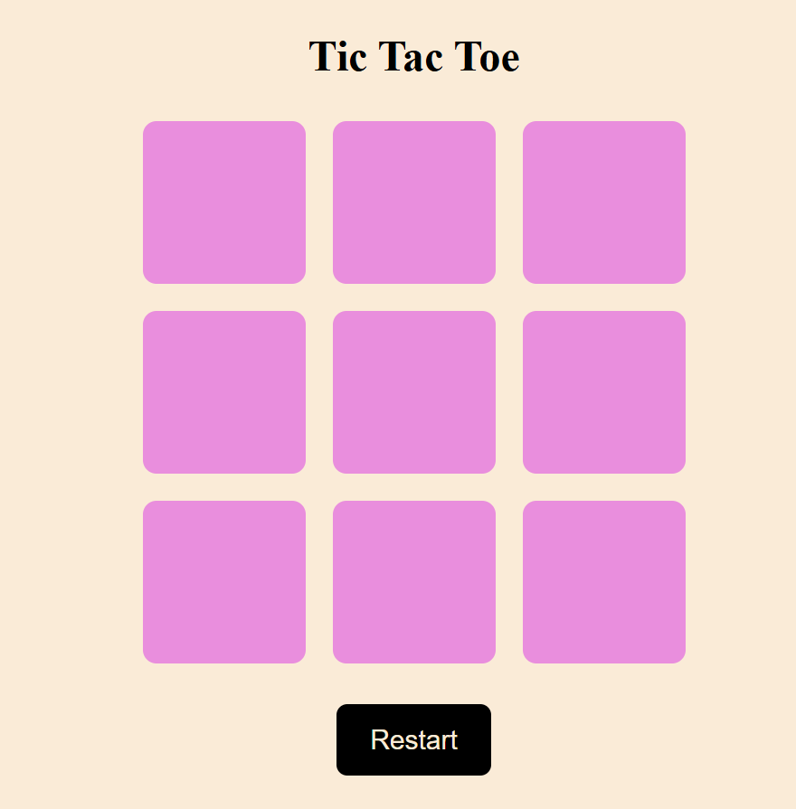
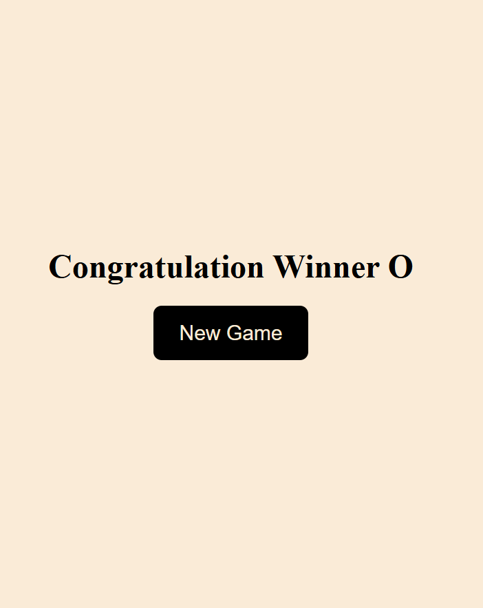

# ❌⭕ Tic Tac Toe Game

A classic **Tic Tac Toe** game built using **HTML, CSS, and JavaScript**.  
This project focuses on DOM manipulation, game logic, and basic UI interactions.

## 🚀 Live Demo
🔗 https://tic-tac-toe-game-orpin-nine.vercel.app/

## 🛠️ Technologies Used
- HTML5
- CSS3
- JavaScript (Vanilla JS)

## ✨ Features
- Two-player gameplay (Player X vs Player O)
- Turn-based logic
- Win, lose, and draw detection
- Game reset functionality
- Clean and responsive UI

## 📂 Project Structure
├── index.html
├── style.css
└── script.js

## 🧠 How to Play
1. Player **X** starts the game
2. Players take turns clicking on empty cells
3. First player to align three marks (row/column/diagonal) wins
4. If all cells are filled with no winner, the game ends in a draw

## 📸 Screenshot

